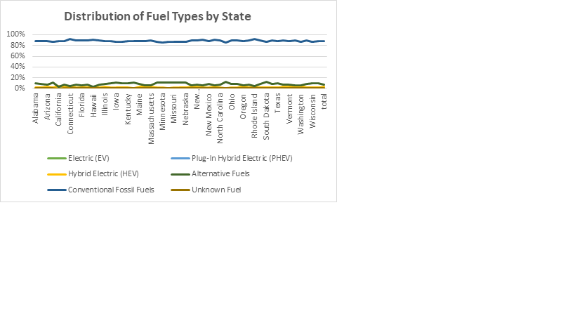
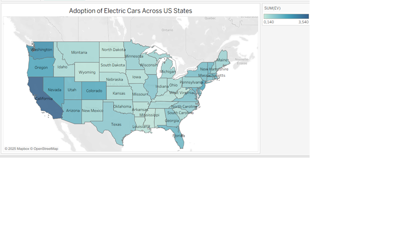
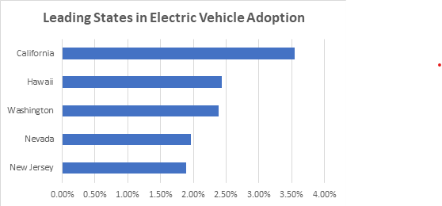
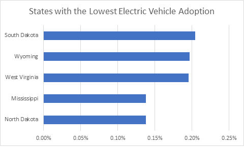
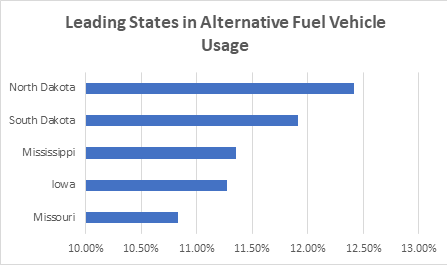
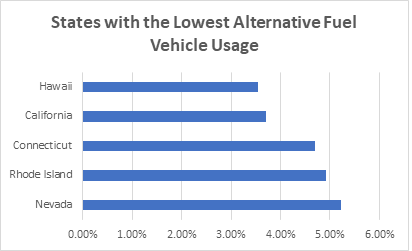

# Analyzing-U.S.-Electric-Vehicle-Market-Share
This project was conducted for a transportation research group and focuses on analyzing the growth and distribution of electric vehicles (EVs) across the United States. The dataset contains vehicle registration counts for multiple fuel types (EV, PHEV, HEV, gasoline, diesel, etc.) by state. 
The objective of this analysis is to identify the states where EV adoption is growing the fastest, compare EV penetration to traditional fuel vehicles. The study also examines the relative importance of alternative fuels and evaluates nationwide fuel distribution patterns.

## The Analysis
### Assessment of Traditional Fuel Distribution and Geographic Dominance.
The analysis of vehicles by fuel type in the United States shows a strong dominance of conventional fossil fuel vehicles, which account for 88.60% of the fleet. Vehicles using alternative fuels remain limited at only 7.4%, while electric vehicles are gradually expanding. Among electric-powered vehicles, Hybrid Electric Vehicles (HEVs) represent the largest share.

This national trend is confirmed when examining vehicle distribution by state: conventional fossil fuel vehicles dominate, alternative fuel vehicles have a small presence, and electric vehicle adoption remains limited, with HEVs leading among electric-powered options.

### Analysis of Regional EV Adoption Maturity and Driving Factors.
Electric vehicle usage in the United States remains relatively modest, with a national average of around 1.3%. This overall rate, still low, nevertheless hides significant regional disparities. Indeed, the adoption of electric vehicles varies considerably from one state to another, reflecting marked differences in public policies, charging infrastructure, economic dynamism, and environmental awareness.

On one hand, several states are experiencing strong growth in electric vehicle usage. California, with a rate of 3.54%, stands far ahead of all others. The state benefits from a dense charging network, attractive financial incentives, and a culture that favors innovation and clean technologies. Other states such as Hawaii (2.44%), Washington (2.38%), and Oregon are also seeing significant increases, supported by proactive policies aimed at promoting the energy transition. Their leadership reflects sustained efforts to encourage the adoption of low-emission vehicles.

On the other hand, some states show very low or even stagnant adoption of electric vehicles. North Dakota and Mississippi, with only 0.14%, ranked at the bottom. These low levels are often explained by the predominance of rural areas, long travel distances, harsh weather conditions, and limited charging infrastructure. The lack of strong local incentives and a historical dependence on traditional fuels also hinder the emergence of electric vehicles in these regions. States such as West Virginia, Wyoming, and South Dakota also present low rates around 0.20%, highlighting similar challenges.

Overall, the analysis shows that although electric vehicle usage is gradually increasing nationwide, this progression is far from uniform. Coastal states, which tend to be more urbanized and more politically committed to reducing emissions, display much higher adoption rates than states in the central regions of the country, which are often more rural and traditionally oriented toward fossil fuels. This contrast underscores the crucial importance of local policies, infrastructure investment, and consumer awareness in accelerating the transition toward more sustainable mobility.

### Examination of Alternative Fuel Progression Across States.
Beyond the development of electric vehicles, the adoption of alternative fuels represents a relevant strategy to reduce the environmental impact of the transportation sector. Alternative fuels — such as biodiesel, ethanol, propane, and hydrogen — help lower emissions of air pollutants and greenhouse gases by partially or fully replacing traditional fossil fuels. Therefore, the use of alternative fuels is not only a complementary solution to vehicle electrification but also a realistic transitional pathway toward more sustainable mobility, particularly in regions where electric charging infrastructure is still limited.

In the United States, vehicles running on these alternative fuels are significantly more prevalent than fully electric vehicles. Indeed, they account for approximately 7.4% of the total American vehicle fleet. This proportion reflects an earlier and more established adoption of these technologies, supported by existing infrastructure and compatibility with conventional engines for certain fuels (such as ethanol and biodiesel).

As with electric vehicles, cars using alternative fuels show a highly heterogeneous geographical distribution across the United States. This uneven distribution highlights that, although alternative fuels are adopted in many states, their use remains strongly influenced by regional factors such as local policies, available infrastructure, and consumer habits, creating areas of high adoption and others where their presence is marginal.

Some states exhibit relatively high adoption of these vehicles: North Dakota leads with 12.41% of its vehicle fleet using alternative fuels, followed by South Dakota (11.91%), Mississippi (11.35%), Iowa (11.27%), and Missouri (10.83%). These figures indicate a significant presence of alternative fuel vehicles in these regions, likely linked to favorable local policies, the availability of alternative fuels, and agricultural practices promoting the use of biofuels such as ethanol and biodiesel.

Conversely, some states display much lower proportions. Hawaii stands at 3.55%, California at 3.71%, Connecticut at 4.69%, Rhode Island at 4.92%, and Nevada at 5.23%. These low percentages reflect more limited adoption of alternative fuels, possibly due to a preference for electric vehicles, reduced availability of certain alternative fuels, or specific economic and geographical conditions in these states.

By analyzing the distribution of alternative fuel vehicle usage on a map of the United States, a clear geographical trend emerges. States with the highest adoption rates are primarily located in the central part of the country, while adoption gradually decreases toward the East Coast. This central concentration can be explained by several interconnected factors:
1.	Agricultural production and biofuel availability: The central regions have historically been major agricultural areas, producing large quantities of raw materials used for ethanol and biodiesel. This proximity facilitates access and reduces logistical costs, promoting the use of alternative fuels.
2.	Local policies and regional incentives: Several states in the central United States have implemented incentive programs to encourage the use of alternative fuels, such as tax credits for vehicles or subsidies for distribution infrastructure. These measures contribute to increased adoption in these regions.
3.	Infrastructure and accessibility: The presence of a sufficient network of stations offering alternative fuels supports their usage. In contrast, coastal states show lower adoption rates, partly due to limited infrastructure and a stronger preference for electric vehicles

By analyzing the maps showing the usage rates of electric vehicles and alternative fuel vehicles, a clear inversion of geographical trends becomes apparent. While electric vehicles are predominantly concentrated along the East Coast — particularly in urban and technologically advanced regions — their presence is relatively limited in the central United States. In contrast, alternative fuels are much more widely used in central states, where their adoption is supported by the availability of biofuels, the importance of agricultural activity, and favorable local policies. Conversely, their usage remains low along the East Coast, where consumer preferences tend to favor electric mobility and where charging infrastructure is more extensively developed. This geographical contrast highlights distinct regional dynamics shaped by local resources, public policies, and energy consumption patterns.

### Conclusion
This study aimed to analyze the adoption of electric vehicles (EVs) across the United States, both in terms of usage rates and geographic distribution. The results show a strong concentration of EVs on the West Coast, while their presence remains significantly lower in the central part of the country. This distribution can be explained by several factors, including population density, local incentive policies, the level of urbanization, and the availability of charging infrastructure.
To better understand the competing dynamics influencing this adoption, the analysis was complemented by a study of alternative fuel vehicles. Unlike electric vehicles, these technologies—such as ethanol, biodiesel, or propane—are particularly widespread in the central states. Their strong presence in the heart of the country is mainly due to local availability of biofuels, existing infrastructure, and an energy culture more oriented toward alternative fuels than electrification.
The territorial analysis conducted in this study allows for the identification of several regions where conditions are particularly favorable to strengthen the company’s presence.
•	California represents a key strategic area. Its EV adoption rate is the highest in the country, making it a market that is already aware of and highly demanding. At the same time, the use of alternative fuels remains low, confirming an energy transition largely oriented toward electrification. For an EV company, investing in charging infrastructure, local partnerships, or enhanced distribution capabilities would help consolidate a presence in this already dynamic market.
•	Hawaii presents a particularly interesting profile. The state shows significant growth in EV usage while having very few alternatives in the field of alternative fuels. This absence of competing solutions, combined with ambitious environmental policies, creates an ideal environment to develop an expanded offering of electric vehicles and associated services (maintenance, charging stations, connected services).
•	Connecticut also represents a high-potential opportunity. Despite limited use of alternative fuels, the state shows steady progress in EV adoption. This imbalance suggests that increasing electrical infrastructure could further accelerate the transition to EVs. For a manufacturing company, establishing a presence in this region would allow it to capture a growing market that is still under-equipped in terms of infrastructure.
In general, areas with high current EV adoption, low competition from alternative fuels, and incentive-driven public policies constitute the most strategic territories for directing commercial and technological investments. By targeting these priority states, the company maximizes its growth potential, strengthens its position in high-potential markets, and supports the energy transition where demand is most significant.

